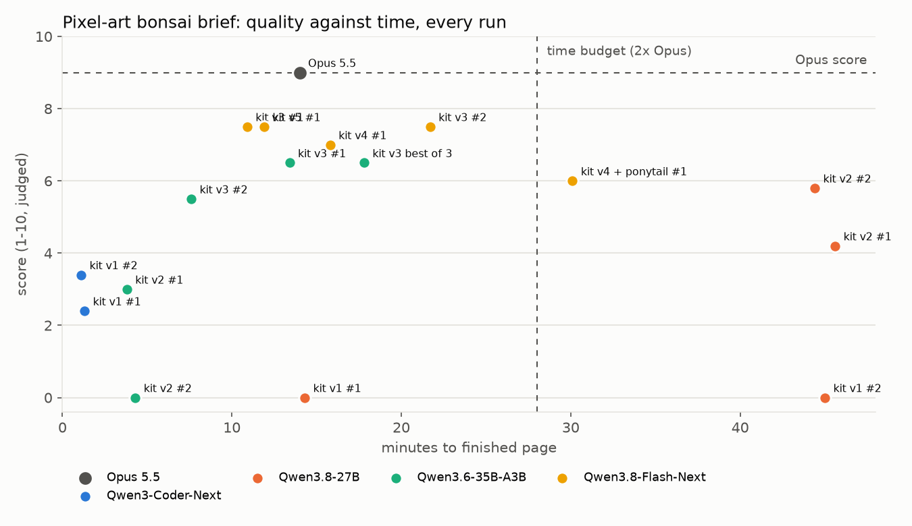
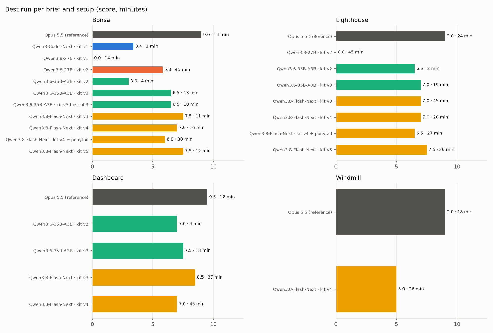
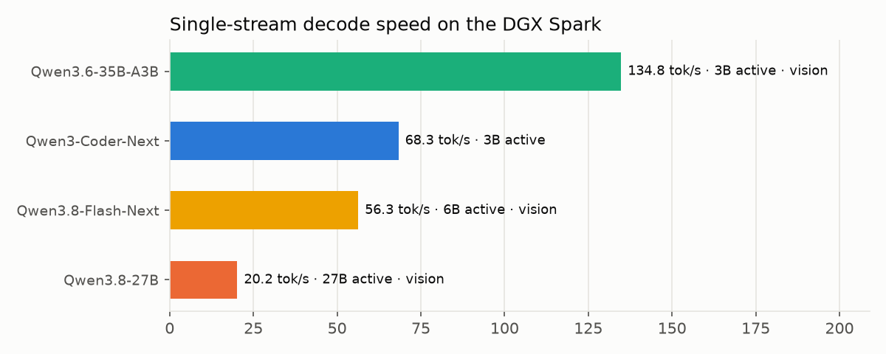

# Qwen benchmarking on DGX Spark

Can a local model on one NVIDIA DGX Spark, wrapped in the right agent harness, build front-end work
at the quality of Claude Opus 5.5, in at most twice Opus's time?

**Not yet, but the gap is narrowing.** With a harness-driven look-and-fix loop in OpenCode, local
models now finish every brief inside the time budget. Qwen3.6-35B-A3B (134.8 tok/s) scores 6.5 to 7.5
against Opus's 9.0 to 9.5; the first Qwen3.8-Flash-Next result (the strongest model that fits on one
Spark) reaches 7.5 on the bonsai brief in 10.9 minutes. Its other runs are in progress (see
[Status](#status)).

## Headline results

| Brief | Opus 5.5 (reference) | Best local run | Gap |
|---|---|---|---|
| Pixel-art bonsai with wind | 9.0 in 14 min | 7.5 in 10.9 min (Qwen3.8-Flash-Next + kit v3) | -1.5 |
| Pixel-art lighthouse at night (held out) | 9.0 in 24.5 min | 7.0 in 18.7 min (Qwen3.6-35B-A3B + kit v3) | -2.0 |
| Personal finance dashboard (held out) | 9.5 in 11.6 min | 7.5 in 17.9 min (Qwen3.6-35B-A3B + kit v3); 8.5 but in 37.3 min, over budget (Qwen3.8-Flash-Next + kit v3) | -2.0 in budget |

**[Open the results viewer](https://mos-ks.github.io/qwen-benchmarking-dgx-spark/)**: Opus's page
on the left, every local run on a slider on the right, per brief.

Static comparison sheets (Opus first, then runs by score):
[bonsai](results/screenshots/sheet-bonsai.png) ·
[lighthouse](results/screenshots/sheet-lighthouse.png) ·
[dashboard](results/screenshots/sheet-dashboard.png)

Open the pages live (they animate):

| Brief | Opus 5.5 | Best local (Qwen3.6-35B-A3B + kit v3) |
|---|---|---|
| Bonsai | [open](https://mos-ks.github.io/qwen-benchmarking-dgx-spark/results/apps/bonsai/opus-5-5-claude-code-ref/) | [open](https://mos-ks.github.io/qwen-benchmarking-dgx-spark/results/apps/bonsai/qwen3-6-35b-a3b-kit-v3-1/) |
| Lighthouse | [open](https://mos-ks.github.io/qwen-benchmarking-dgx-spark/results/apps/lighthouse/opus-5-5-claude-code-ref/) | [open](https://mos-ks.github.io/qwen-benchmarking-dgx-spark/results/apps/lighthouse/qwen3-6-35b-a3b-kit-v3-1/) |
| Dashboard | [open](https://mos-ks.github.io/qwen-benchmarking-dgx-spark/results/apps/dashboard/opus-5-5-claude-code-ref/) | [open](https://mos-ks.github.io/qwen-benchmarking-dgx-spark/results/apps/dashboard/qwen3-6-35b-a3b-kit-v3-1/) |

All generated pages are in [`results/apps/`](results/apps/) and open directly in a browser; the
frames are in [`results/screenshots/`](results/screenshots/). Raw numbers:
[`results/data/`](results/data/).

## What moved the needle

1. **The harness has to make the model look at its own output.** Telling a model "check your page"
   in its rules does little: one run called the screenshot tool 0 times and shipped a blank page,
   another called it 19 times and ran out of time. Kit v3 moves that decision into the harness: an
   OpenCode plugin screenshots the page whenever the agent stops, a vision model critiques it, and
   the critique goes back as the next turn (3 rounds at most). No broken page has shipped since.
2. **The model needs eyes.** Qwen3-Coder-Next is text-only; it cannot use the loop and drew floating
   circles and blobs in every harness. Vision-capable Qwen3.8-27B and Qwen3.6-35B-A3B can.
3. **Speed decides whether the loop fits the budget.** Qwen3.8-27B (dense, 20 tok/s) produced real
   pixel art with kit v2 but hit the 45-minute limit every time; Qwen3.6-35B-A3B (3B active,
   134.8 tok/s) runs the same loop in 7 to 19 minutes.
4. **Best-of-N removes bad draws but does not raise the ceiling.** Three parallel attempts with the
   vision model picking the winner landed on the same 6.5 as the best single run.
5. **A "write less code" skill hurts visual work.** Ponytail tells the agent to build the smallest
   version that does the core job. On from-scratch pixel art that cut craft (stacked round pads, a
   flat slab pot) without saving time: 6.0 and 6.5 against kit v4's 7.0 and 7.0.
6. **Easy, well-scoped coding tasks do not separate anything.** Every model and harness passed five
   small agent tasks and a feature added to an existing codebase. Differences only appear on
   from-scratch and visual work.

## Setup

| | |
|---|---|
| Hardware | 1x NVIDIA DGX Spark (GB10 Grace-Blackwell, 128 GB unified memory, aarch64) |
| Serving | vLLM (OpenAI-compatible API), served name `qwen3-coder` whatever the model; settings per model in [`serving/`](serving/README.md) |
| Harness | [OpenCode](https://opencode.ai) 1.18 in server mode (its HTTP API, the path a user's tools take) |
| Reference | Claude Opus 5.5 as a Claude Code subagent, same brief, same 45-minute limit, allowed to screenshot its page |
| Models | Qwen3-Coder-Next NVFP4 (80B / 3B active), Qwen3.8-27B NVFP4 + MTP-3 (dense), Qwen3.6-35B-A3B NVFP4 + MTP-3 (NVIDIA build), Qwen3.8-Flash-Next NVFP4 (125B / 6B active, in progress) |

### Harness versions

| Version | Adds |
|---|---|
| kit v1 | [`harness/AGENTS.md`](harness/AGENTS.md) rules (done = a check passed, read before writing, check library versions, no summary files, git) and 17 on-demand skills |
| kit v2 | the `pixel-art`, `visual-check` and `dataviz` skills, the [`look`](harness/tools/look) tool (screenshots + vision critique, round budget enforced), thinking off |
| kit v3 | the [`visual-supervisor`](harness/plugins/visual-supervisor.js) OpenCode plugin: the harness runs `look` when the agent stops and sends the critique back, up to 3 rounds |
| best of 3 | three kit v3 sessions in parallel, [`pick`](harness/tools/pick) chooses the winner with the vision model |
| kit v4 | score-driven supervision: the critic first lists the brief's requirements, scores 1 to 10 and names the unmet ones; the plugin keeps sending fixes until 8/10, 4 rounds or 25 minutes. The `pixel-art` skill gains a fill-the-screen rule |
| kit v4 + ponytail | kit v4 with the [ponytail](https://github.com/DietrichGebert/ponytail) "smallest change that works" skill as always-on instructions |
| kit v5 | the `pixel-art` skill ships [`pixel-kit.js`](harness/skills/pixel-art/pixel-kit.js), a tested drawing library the agent copies into the project (full-screen integer scaling, shaded trunks and foliage pads, jagged faceted rocks, rolling sea and foam, beams, glows, particles, text-grid sprites, 16 colour ramps); the agent may read, never edit, the skills folder |

Third-party skills used (not redistributed here; install from their repos):
[obra/superpowers](https://github.com/obra/superpowers) (TDD, debugging, verification, plans),
[addyosmani/agent-skills](https://github.com/addyosmani/agent-skills) (incremental work, source-driven development, security, API design),
[pbakaus/impeccable](https://github.com/pbakaus/impeccable),
[Leonxlnx/taste-skill](https://github.com/Leonxlnx/taste-skill),
[vercel-labs/agent-skills](https://github.com/vercel-labs/agent-skills) (React, React Native, web design guidelines),
[microsoft/playwright-cli](https://github.com/microsoft/playwright-cli),
[VoltAgent/awesome-design-md](https://github.com/VoltAgent/awesome-design-md), and ui-ux-pro-max.

## Method

- **Briefs**: [`tasks/`](tasks/). One-shot prompts, identical for every model. The bonsai brief is the
  one the harness was iterated on; the lighthouse and dashboard briefs are held out. Their
  critiques informed kit v5, so the windmill brief was added afterwards as a fresh held-out test.
- **Timing**: wall clock from the first prompt until the session settles (idle for 60 s after any
  supervisor round), capped at 45 minutes. The goal is at most 2x Opus's time on the same brief.
- **Scoring**: screenshots (three desktop frames 1.5 s apart, one phone frame) judged 1 to 10 on
  recognizability, visual craft, animation, layout and polish. **The judge is Claude Opus 5.5 and is
  not blind**: it knew which run came from which model and belongs to the reference's own family,
  so expect a bias toward the reference. Every screenshot and page is published so you can judge
  for yourself.
- **Code checks** (deterministic, no judge): BigCodeBench-Hard (89 tasks, partial credit = share of
  unit tests passed), five small agent tasks, a feature added to an existing TypeScript project and
  a standard-library HTTP + SQLite API built from an empty folder, both scored by
  [hidden tests](tasks/agent-tasks/hidden-tests/) the agent never sees.

| Check | Qwen3-Coder-Next | Qwen3.8-27B |
|---|---|---|
| BigCodeBench-Hard, bare / terse prompt | 0.579 / 0.608 | 0.633 / 0.582 |
| 5 agent tasks, OpenCode + kit (10 attempts) | 10/10 | 10/10 |
| Greenfield API, OpenCode + kit (mean of 3) | 0.57 | 0.60 |
| Greenfield API, OpenCode without rules or skills | 0.2 | |
| Greenfield API, Qwen Code 0.25 | 0.60 | |

Small samples (2 to 3 runs per cell); treat differences under about one point as noise.

## Harness traps found on the way

- Qwen Code 0.25 hides some tool schemas behind `tool_search`; Qwen3-Coder-Next then calls those
  tools with guessed arguments, and three bad calls in one turn stop the turn ("The model got stuck
  while using tools"). Fix: `tools.toolSearch.threshold: 20`.
- `opencode run` hangs if stdin stays open (pass `< /dev/null`), its SQLite database locks when
  several runs share it (set `XDG_DATA_HOME` per run), and it exits on idle before a plugin can act,
  so the supervisor only works in server mode.
- In server mode with nobody at the UI, three permission defaults block forever: `question`
  (the model asks the user something), `external_directory` (it opens a screenshot outside the
  project) and `doom_loop`. [`harness/opencode.json`](harness/opencode.json) denies all three.
- Qwen3.8 with thinking on sometimes ends a turn with an announcement and no tool call; thinking off
  avoids it. vLLM's `tool_choice: "required"` returned an empty tool-call list on the build used
  (`auto` works).
- Qwen3.8-Flash-Next takes nearly all of the Spark's memory; under four parallel agent sessions
  (each with a headless browser for screenshots) the recipe's memory watchdog stopped it twice. It
  now runs with a smaller KV cache and two sessions at a time.

## Status

- Done: Qwen3-Coder-Next, Qwen3.8-27B, Qwen3.6-35B-A3B on all briefs and harness versions above.
- Qwen3.8-Flash-Next with kit v3: bonsai 7.5 (10.9 and 21.7 min), lighthouse 7.0 (hit the 45 min cap), dashboard 8.5 (37.3 min, over its 23 min budget). Best quality so far, but slower than the budget on the larger briefs.
- Qwen3.8-Flash-Next with kit v4: bonsai 7.0 (15.8 min), lighthouse 7.0 (27.7 min, down from the 45 min cap with kit v3). The 25-minute supervision budget stopped the overrun; quality did not move (one run each, so within noise).
- Kit v4 plus the [ponytail](https://github.com/DietrichGebert/ponytail) skill (loaded as always-on instructions) on Flash-Next: bonsai 6.0 (30.1 min), lighthouse 6.5 (27.3 min). Lower on both briefs and no faster, so it stays out of the kit.
- Kit v4 on the new windmill brief: 5.0 (25.5 min). On the dashboard it wrote its own Playwright check script and verified for the whole 45 minutes, so the supervisor never got a turn: 7.0, timeout.
- Kit v5 (drawing library): bonsai 7.5 in 11.9 min, lighthouse 7.5 in 25.9 min, the best lighthouse and the fastest good bonsai so far. The critic scored both 8 or more on its first look, so no supervisor rounds ran.
- In progress: kit v5 on the windmill brief (held out from every kit change), then kit v5.1 (tool results carry a wrap-up note after 20 minutes) on the dashboard, twice.
- This repository is updated as runs finish.

## Reproduce

1. Serve a model as in [`serving/README.md`](serving/README.md).
2. Install [OpenCode](https://opencode.ai), copy [`harness/opencode.json`](harness/opencode.json) and
   [`harness/AGENTS.md`](harness/AGENTS.md) to `~/.config/opencode/`, the plugin to
   `~/.config/opencode/plugins/`, and put [`harness/tools/look`](harness/tools/look) and
   [`pick`](harness/tools/pick) on `PATH` (they need [uv](https://docs.astral.sh/uv/) and Playwright's
   Chromium).
3. Start `opencode serve --port 4096` and run a brief:
   `python scripts/run_server_agent.py http://127.0.0.1:4096 tasks/bonsai.txt out/bonsai-1`.
4. Screenshot it with `scripts/capture_simple.py out/bonsai-1`; charts come from
   `uv run --with matplotlib python scripts/make_charts.py`.

## License

MIT for everything in this repository (see [LICENSE](LICENSE)). The pages under `results/apps/`
were written by the models named in their folder names.
